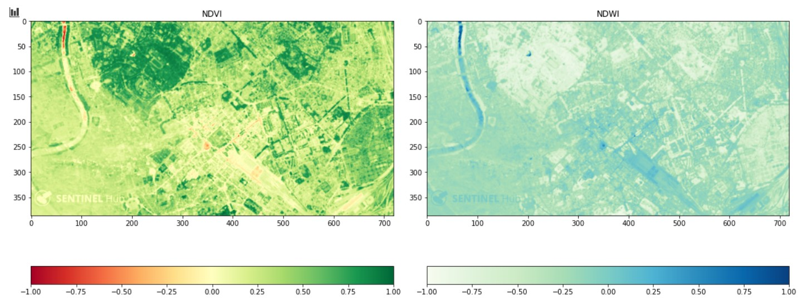
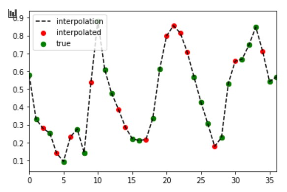
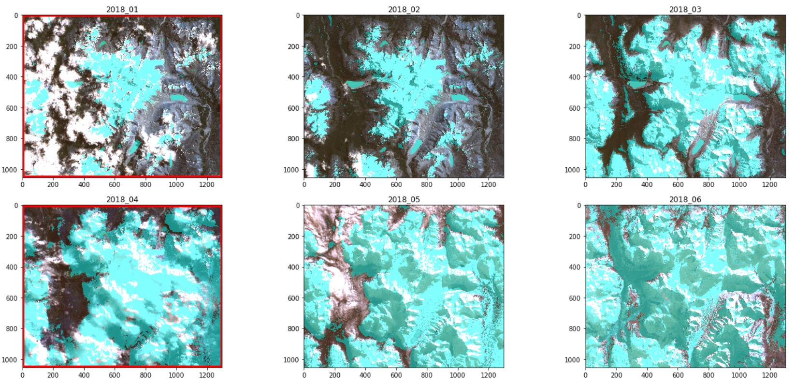
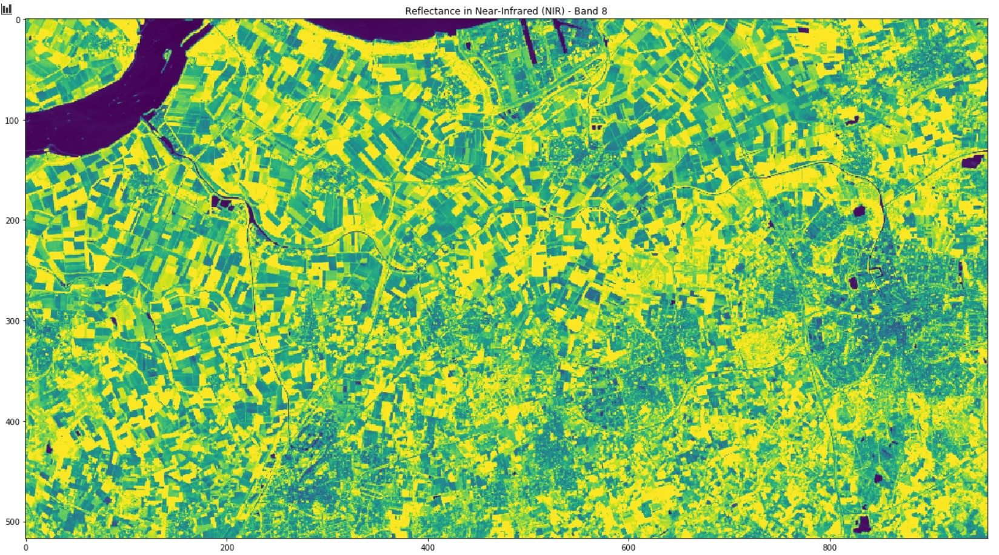
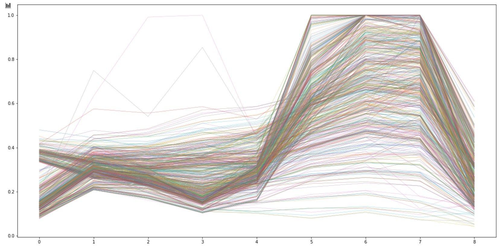
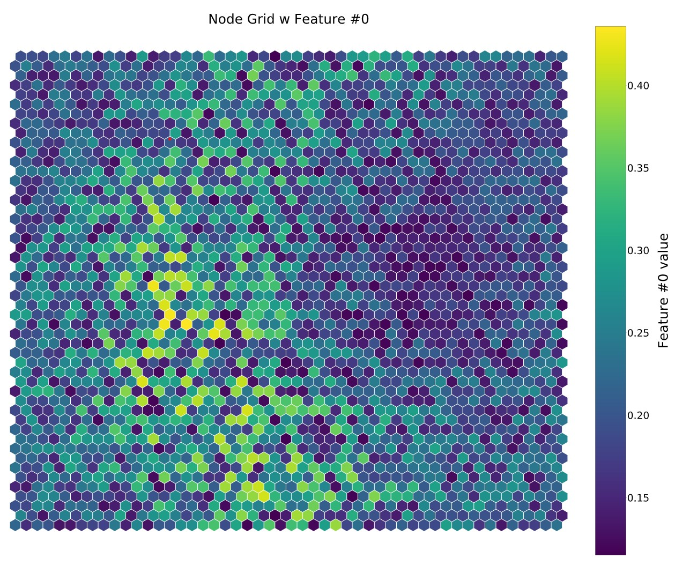
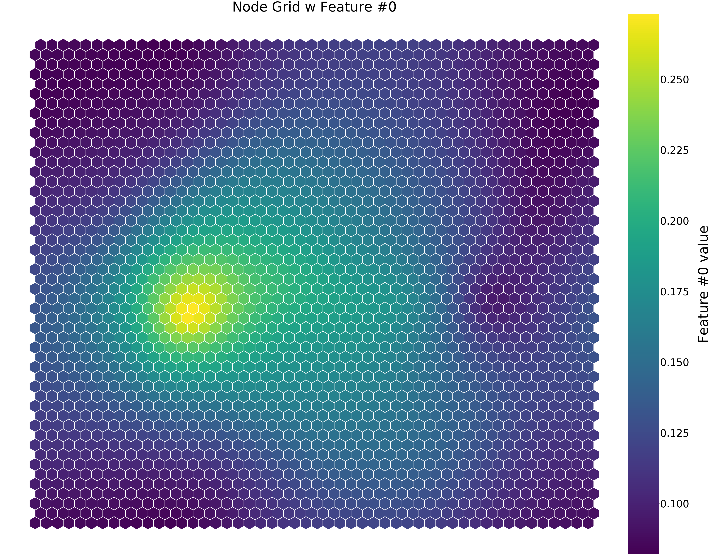

# Python for Earth Oservation

This Repository is for playing around with Python for Satellite Data analysis. 
By using freely available Sentintinel-2 data, a few applications are axplored in jupyter notebooks here. The Sentinel-2 data ist multi-spectral, making 12 bands from visible light to infrared available for investigation. By combining these bands in different combinations use cases from snow detection, over vegetation monitoring to extracting urban features can be analysed.

These notebooks are currently in this repository:

- [Python for Raster Analysis](PythonforRasterAnalysis.ipynb)
- [Raster Time Series Interpolation](RasterTimeseriesInterpolation.ipynb)
- [Crop Classification](CropClassification.ipynb)

The repositories are all just a playground, so they are constantly work in progress and there might be more elegant ways of using the problems, so don't be to harsh on judgemtns and please let me know if you have ideas on how to improve the scripts ;)

## Python for Raster Analysis
Contains the basic functionality of how to read raster data into python and perform raster calculations and visualization.

__________________________________________________________________________________________________________

## Time Series Interpolations
This notebook suggests a way to temp-spatially interpolate satellite data for missing scenes due to cloud cover. By calculation the NDSI (Normalized Difference Snow index) over  "Cerro San Lorenzo" at the border between Argentina and Chile. the average snow cover per month is calculated.

As some months are not in the data set due to heavy cloud cover, the graph shows gaps. These can be calculated by a spline interpolation

  

For further spatial analysis, however,  the actual raster mask of snow cover may be needed and this is where the spatial aspect of this interpolation approach comes into play. By taking the total snow cover values from the graph interpolation. The new raster will be created accordingly.

_____________________________________________________________________________________________________________________

## Crop Classification (using Self Organizing Maps)

This notebook makes use of the spectral signatures of various crops to cluster crops by using an Artificial Neural Network and Self Organizing Maps.
First the multi-spectral Sentinel-2 data will be loaded and the pixel values will be pooled, to reduce calculation time. Then Then each pixel will be converted into a vector representing the spectral signatures for the 9 bands in use (Band 1 to 9).

After that the approach of Self Organizing maps using Artificial Neural Networks will be implemented to perform and unsupervised cluster analysis for these vectors and group similar spectal signatures. Lastly the clusters will be compared to the library of spectral signatures in order to find out which crop the clusteres fields are actually growing.

Looking at a the refleactance of a singel band in a raster can give a overview over the area:

Looking at the spectral signature for a single pixel in all 9 bands, can show which kind of land cover lays unterneath

By turning the reflectance of each pixel into a vector representing the spectral signature, the Self Organizing Map can be trained in order to allow clustering.

The hexagonal Map shows the ditribution of bins for the layer refelction of visible red for each pixel. The more iterations were performed, the better the bins will be sorted and smoother the hexagonal grid will be:

Binning after 1000 iterations

Binning afer 10000 iterations:

By comparing the binned heatmap for each variable the correlation between variabels can be inspected. Variables showing the same distribution are strongly positivly correlated,  opposite maps show negative correlation. A very noisy heatmap would represent a variable, which has no influence on the binning.